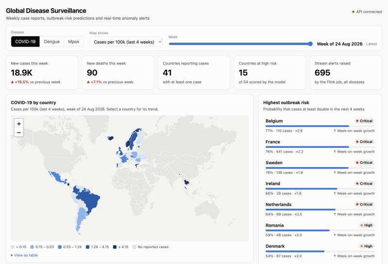
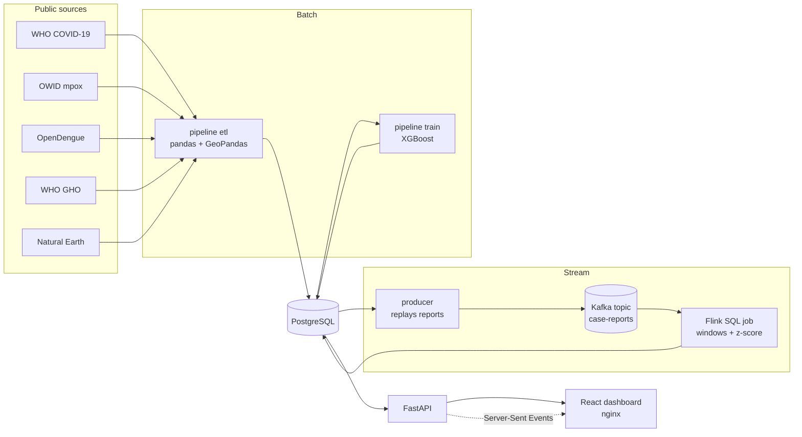
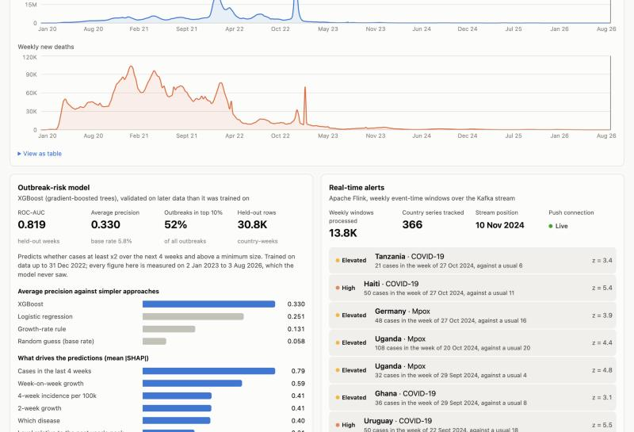

# Global Disease Surveillance & Outbreak Analytics Platform

A full-stack platform that brings public disease datasets into one PostgreSQL database,
serves them through a FastAPI REST API, predicts outbreak risk with XGBoost, detects
anomalies in real time with Apache Flink, and presents everything in an interactive React
map dashboard. Every service is containerised and ships with Kubernetes manifests and an
Azure (AKS) deployment script.

**Stack:** Python · FastAPI · React · PostgreSQL · GeoPandas · XGBoost · Apache Flink ·
Kafka API (Redpanda) · Docker · Kubernetes · Azure



## What it does

| Capability | How |
|---|---|
| **Integrates public data** | Weekly COVID-19 (WHO), mpox (WHO via Our World in Data) and dengue (OpenDengue) counts for 235 countries and territories, plus annual cholera and measles totals (WHO GHO). About 119,000 country-weeks. |
| **Geospatial layer** | GeoPandas builds the country reference table from Natural Earth: ISO codes, population, simplified map geometry and a neighbour graph used as model features. |
| **REST API** | 16 FastAPI endpoints: time series, map snapshots, country profiles, risk scores, model card, alerts, and a Server-Sent Events stream. OpenAPI docs at `/api/v1/docs`. |
| **Outbreak-risk model** | XGBoost estimates, for every country and week, the probability that cases at least double over the next four weeks. Each score comes with its main SHAP drivers. |
| **Real-time processing** | A Flink SQL job reads case-report events from Kafka, aggregates them in event-time weekly windows, compares each week with a rolling eight-week baseline and writes alerts to PostgreSQL. |
| **Dashboard** | React + Leaflet choropleth, risk ranking, country drill-down with model back-test, model card and a live alert feed. Light and dark themes. |
| **Operations** | Docker Compose for local use; Kustomize base with local and AKS overlays; `infra/azure/deploy.sh`; GitHub Actions CI. |

## Architecture



## Run it

Requirements: Docker with about 4 GB of memory available to it.

```bash
docker compose up --build
```

| URL | What |
|---|---|
| http://localhost:8080 | Dashboard |
| http://localhost:8000/api/v1/docs | API documentation (Swagger UI) |
| http://localhost:8081 | Flink web UI |

On first start the `pipeline` container downloads the datasets (about 25 MB), loads
PostgreSQL and trains the model; this takes three to four minutes. The API and dashboard
start once it finishes. The `producer` then replays reports from 2023 onwards into Kafka at
one week every two seconds, and alerts begin to appear in the dashboard after roughly 20 seconds.

Stop with `docker compose down` (add `-v` to delete the data volumes too). The broker keeps
no volume, so the next `docker compose up` starts an empty topic and replays from the
beginning. If the topic already holds a replay, the producer leaves the stream untouched.

### Without Docker

```bash
# backend (needs a local PostgreSQL)
cd backend
python -m venv .venv && source .venv/bin/activate
pip install -r requirements-dev.txt
python -m pipeline all                  # ETL + model training
uvicorn app.main:app --reload           # http://localhost:8000/api/v1/docs
pytest                                  # 27 tests

# frontend
cd frontend
npm install
npm run dev                             # http://localhost:5173, proxies /api to :8000
```

`DATABASE_URL` selects the database (default `postgresql+psycopg2://localhost:5432/disease_surveillance`).

## Data pipeline

`python -m pipeline etl` downloads each source once (cached), normalises it to one row per
disease, country and ISO week, and upserts into PostgreSQL with `COPY` + `ON CONFLICT`.

| Source | Content | Licence |
|---|---|---|
| [WHO COVID-19 dashboard](https://data.who.int/dashboards/covid19) | Weekly cases and deaths, 2020 onwards | CC BY 4.0 |
| [Our World in Data mpox](https://ourworldindata.org/mpox) | Daily cases and deaths, summed to weeks | CC BY 4.0 |
| [OpenDengue v1.3](https://opendengue.org) | Weekly national dengue cases | CC BY 4.0 |
| [WHO Global Health Observatory](https://www.who.int/data/gho) | Annual cholera and measles cases | CC BY-NC-SA 3.0 IGO |
| [Natural Earth](https://www.naturalearthdata.com) | 1:50m country boundaries, population | Public domain |

Details worth knowing:

- Each source defines a week differently (WHO dates a week by its closing Sunday,
  OpenDengue uses Sunday-to-Saturday weeks, mpox is daily). All are mapped to ISO weeks
  starting on Monday.
- Weeks a country did not report are kept and flagged `reported = false` so they are never
  mistaken for zero cases.
- Reporting trails off unevenly at the end of each series. The "latest week" shown for a
  disease is the last week in which at least half of the recent peak number of countries reported.

The schema is in `backend/sql/schema.sql`: `countries`, `country_neighbours`, `diseases`,
`case_reports`, `annual_indicators`, `model_runs`, `risk_scores`, `stream_weekly_counts`,
`stream_alerts`, and the views `v_weekly_incidence`, `v_global_weekly`, `v_active_run`.

## Outbreak-risk model

**Question.** At the end of each week, for each country and disease: will cases over the
next four weeks be at least double the last four weeks, and reach a meaningful size?

**Features (28).** Recent level and incidence, growth over one, two and four weeks and its
acceleration, deviation from a 12-week baseline, position relative to the past year's peak,
what happened at the same point last year, reporting completeness, the situation in
neighbouring countries and the wider subregion, global trend, season and latitude.

**No look-ahead.** Every feature uses data up to the scoring week only. A unit test changes
future values and asserts that earlier feature rows stay identical.

**Out-of-time validation.** The model is trained on data up to the end of 2022 and tested on
January 2023 to August 2026, about 30,800 country-weeks it never saw.

| Held-out performance | ROC-AUC | Average precision |
|---|---|---|
| **XGBoost** | **0.82** | **0.33** |
| Logistic regression (same features) | 0.75 | 0.25 |
| Growth-rate rule (rank by 4-week growth) | 0.70 | 0.13 |
| Base rate | – | 0.058 |

The 10% of country-weeks with the highest scores contain 52% of all outbreaks.

| By disease | Country-weeks | Outbreaks | ROC-AUC | Average precision |
|---|---|---|---|---|
| COVID-19 | 16,779 | 1,221 | 0.89 | 0.42 |
| Dengue | 2,930 | 222 | 0.89 | 0.44 |
| Mpox | 11,056 | 351 | 0.81 | 0.09 |

Re-training before each year and testing on that year gives ROC-AUC between 0.81 and 0.93
(2021 to 2025), so performance does not depend on one lucky split.

Honest caveats:

- Mpox is the weak spot. Counts are small and outbreaks begin abruptly, so the model ranks
  them reasonably (ROC-AUC 0.81) but with low precision.
- The target is a surge in *reported* cases. Changes in testing or reporting practice look
  the same as real surges.
- Exact figures move by a point or two between platforms because of XGBoost's histogram
  construction. The numbers above are from the Docker image.

Scores are stored for every week after the training cut-off, together with what actually
happened once known, so the dashboard shows a genuine back-test.

## Real-time processing

Public surveillance data is published weekly, so there is no live feed to subscribe to.
`backend/stream/producer.py` simulates one: it splits the stored weekly counts into daily
report events and publishes them to Kafka in calendar order at accelerated speed. The Flink
job treats the topic exactly as it would a live source.

`flink/sql/outbreak_detection.sql`:

1. **Source** – Kafka topic `case-reports`, JSON, event-time watermark seven days behind.
2. **Weekly windows** – 7-day event-time tumbling windows, one per ISO week, disease and country.
3. **Rolling baseline** – an `OVER` window over the previous eight weeks gives the mean and
   standard deviation, excluding the current week.
4. **Alert rule** – at least 20 cases, at least double the baseline mean, and a z-score of 3
   or more, with a Poisson floor so that small counts need a proportionally larger jump.
5. **Sinks** – JDBC upserts into `stream_weekly_counts` and `stream_alerts`.

The API pushes new alerts to the browser over Server-Sent Events (`/api/v1/alerts/stream`).

**Checked against the batch data.** The stream and the batch ETL count the same reports by
independent routes, so after a full replay their weekly totals must agree.
`flink/sql/reconcile.sql` compares them: all 407 disease-weeks match exactly, across repeated
replays at different speeds.

That check caught a real bug. Aligning the windows to Monday with `TUMBLE`'s offset argument
silently dropped three to five whole weeks per replay, with no error and no late-record
metric. Flink's window operator buffers rows in memory and only flushes them when the
watermark crosses an epoch-aligned boundary, ignoring the offset, so a watermark landing
between the two boundaries marks a window as fired before its rows reach state. The job now
shifts event time by three days instead, which makes ISO weeks coincide with Flink's
epoch-aligned windows and needs no offset.



## API

| Endpoint | Returns |
|---|---|
| `GET /health`, `GET /ready` | Liveness and readiness (used by the Kubernetes probes) |
| `GET /diseases` | Diseases, sources, coverage |
| `GET /summary?disease=` | Headline figures for the latest week |
| `GET /cases/global?disease=` | Worldwide weekly series |
| `GET /cases/timeseries?disease=&iso3=` | One country's weekly series |
| `GET /cases/map?disease=&week=` | Per-country snapshot for the map |
| `GET /geo/countries` | Country polygons (GeoJSON) |
| `GET /countries/{iso3}` | Country profile, neighbours, per-disease status |
| `GET /annual?indicator=&iso3=` | Annual cholera or measles totals |
| `GET /risk/scores?disease=&week=&min_level=` | Ranked outbreak-risk scores with SHAP drivers |
| `GET /risk/history?disease=&iso3=` | Risk over time with outcomes |
| `GET /risk/model` | Model card: metrics, feature importance |
| `GET /alerts`, `GET /alerts/stream` | Flink alerts (list and live stream) |
| `GET /stream/status` | How much the streaming job has processed |

All paths are under `/api/v1`.

## Kubernetes and Azure

```
k8s/base/                 namespace, config, PostgreSQL and Redpanda StatefulSets, API (HPA + PDB),
                          dashboard + Ingress, Flink session cluster, pipeline Job + weekly CronJob,
                          Flink job-submit Job, replay Job, NetworkPolicy for the database
k8s/overlays/local/       single replicas, LoadBalancer on localhost:8080, development secret
k8s/overlays/azure/       ACR images, managed-csi storage, AKS application-routing ingress
infra/azure/deploy.sh     resource group -> ACR -> AKS -> build images -> secret -> apply -> wait
infra/azure/teardown.sh   deletes the resource group
```

Local cluster (Docker Desktop Kubernetes, kind or minikube), after `docker compose build`.
This path is tested: all workloads start, the jobs complete and the stream reconciles.
The autoscaler stays idle locally because Docker Desktop ships no metrics server; AKS does.

```bash
kubectl apply -k k8s/overlays/local
kubectl -n surveillance get pods -w
# dashboard on http://localhost:8080 once the pipeline job has completed
kubectl delete -k k8s/overlays/local
```

Azure:

```bash
az login
./infra/azure/deploy.sh        # asks for confirmation before creating billable resources
./infra/azure/teardown.sh      # removes everything
```

The script creates a two-node `Standard_B2ms` AKS cluster and a Basic container registry,
builds the three images in ACR, generates a random database password into a Kubernetes
Secret and prints the public address. Run the teardown script when you are done, since the
cluster is billed by the hour.

The Azure overlay renders and differs from the tested local one only in image names, storage
class and ingress class, but the script itself has not yet been run against a subscription.

## Tests and CI

| Suite | Covers |
|---|---|
| `backend/tests/test_transform.py` | Source normalisation: week alignment, Namibia's `NA` code, negative corrections, partial weeks |
| `backend/tests/test_features.py` | Label definition, no look-ahead, reporting gaps, neighbour features |
| `backend/tests/test_api.py` | Every endpoint against a seeded PostgreSQL database |
| `frontend/src/*.test.ts` | Formatting and choropleth class breaks |
| `flink/sql/reconcile.sql` | Stream totals against batch totals after a replay |

`.github/workflows/ci.yml` runs linting and tests for both halves against a PostgreSQL
service container, builds the images and renders the Kubernetes manifests.

## Project layout

```
backend/
  app/            FastAPI application (routers: meta, geo, cases, risk, alerts)
  pipeline/       sources, transform, geo, load, etl, features, model
  stream/         Kafka replay producer
  sql/            schema
  tests/
flink/            Flink image, SQL job, submit script, reconciliation query
frontend/         React + TypeScript dashboard (Vite), nginx config
k8s/              Kustomize base and overlays
infra/azure/      AKS deployment scripts
```
